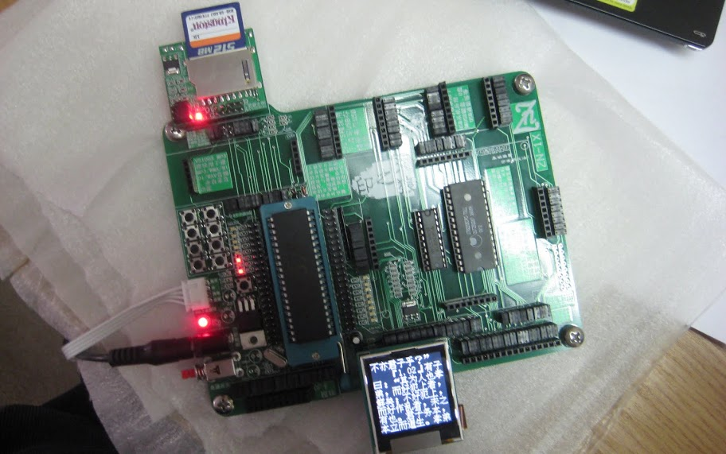

# muBook

A very low cost ebook reader 

* **Note:** This project is no longer actively developed. This repo is mainly for archiving purpose.

# Introduction

This main purpose of this project is to demonstrate the possibility to create an ebook reader at a very low cost. The target cost is set to 20USD. This project is using a MCU development board with a price tag of a little bit over 40USD. The board however comes with many unused parts which can be removed to reduce the cost, hopeful to meet the target.

This project is not to build a fancy or a fully-featured ebook reader. Rather, only the very essential features are supported to keep the cost low.

_Keep it simple, usable and cheap._

## Hardware

The main hardware piece used in this project includes:

* `STC12C5A60S2` as MCU with 22.1184Mhz clock, ~1USD.
* 1.6" 128x128 TFT screen with `Samsung S6D0117` controller, ~10USD.
* SD card reader and 1x 512M SD card, ~10USD.

All the pieces are included in a [ZN-1X development board](http://www.znmcu.cn/), which costed me for 275RMB/41USD (S&H included), as of 2011.

## Software

* The file system is from [znFat project](https://gitee.com/f4cker/znfat/tree/master).
* Some code are from examples coming with the development board.

## Books

Fortunately there are many ebooks already available. Currently only TXT books are supported to make things simple.
